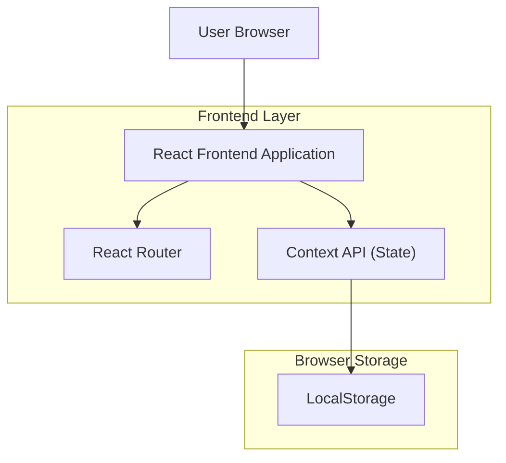

## 1.Architecture design


## 2.Technology Description
- Frontend: React@18 + React Router + Context API + tailwindcss@3 + vite
- Backend: None

## 3.Route definitions
| Route | Purpose |
|---|---|
| / | Página Inicial (app shell + navegação + exemplo de estado) |
| /exemplo | Página interna para validar roteamento, componentes e consumo do Context |
| * | Página 404 para rotas inexistentes |

## Estrutura de pastas (sugerida)
```
src/
  app/
    App.tsx
    router.tsx
  contexts/
    AppStateContext.tsx
  hooks/
    useLocalStorage.ts
  pages/
    HomePage.tsx
    ExamplePage.tsx
    NotFoundPage.tsx
  components/
    layout/
      Header.tsx
      Footer.tsx
  styles/
    index.css
  main.tsx
```

## Persistência em LocalStorage (diretriz)
- Centralizar leitura/escrita em `useLocalStorage` e/ou no provider do Context.
- Serializar estado com JSON e versionar chave (ex.: `rnn:v1:app_state`).

## Comandos de instalação e execução
```bash
# instalar dependências
npm install

# instalar libs principais
npm i react-router-dom

# dev server
npm run dev

# build
npm run build

# preview
npm run preview
```
