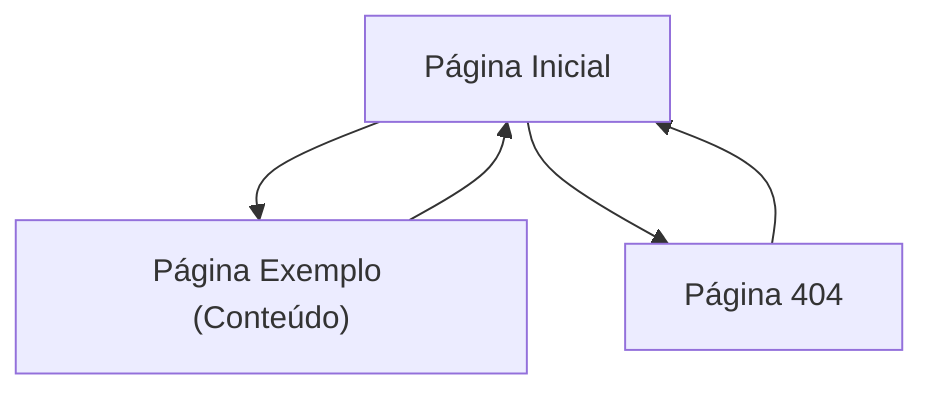

## 1. Product Overview
Projeto base (starter) para o site “Raízes do Nordeste”, construído com React + Vite + Tailwind.
O objetivo é oferecer um esqueleto sólido com navegação (React Router), estado global (Context API) e persistência (LocalStorage).

## 2. Core Features

### 2.1 Feature Module
O produto mínimo consiste nas seguintes páginas principais:
1. **Página Inicial**: cabeçalho com navegação, seção de boas-vindas, CTAs para explorar o app.
2. **Página Exemplo (Conteúdo)**: layout de página interna para validar roteamento e composição de componentes.
3. **Página 404 (Não encontrado)**: fallback para rotas inexistentes.

### 2.3 Page Details
| Page Name | Module Name | Feature description |
|---|---|---|
| Página Inicial | App Shell | Renderizar layout base (Header/Container/Footer) e área de conteúdo via rotas. |
| Página Inicial | Navegação | Navegar para páginas internas via React Router (links ativos e rota padrão). |
| Página Inicial | Estado Global | Ler/atualizar estado no Context API e refletir no UI. |
| Página Inicial | Persistência | Persistir e restaurar estado no LocalStorage (ex.: preferências/itens salvos). |
| Página Exemplo (Conteúdo) | Conteúdo | Exibir componentes de exemplo para validar Tailwind e organização de UI. |
| Página Exemplo (Conteúdo) | Integração com Context | Consumir estado global e permitir ação simples (ex.: alternar preferência). |
| Página 404 | Roteamento | Exibir mensagem de rota inválida e link para voltar à Página Inicial. |

## 3. Core Process
Fluxo principal (usuário):
1. Você acessa a Página Inicial.
2. Você navega para a Página Exemplo pelo menu.
3. Você interage com um controle que altera um estado global.
4. Ao recarregar o navegador, o estado é restaurado do LocalStorage.
5. Se você acessar uma rota inexistente, cai na Página 404 e retorna para a Inicial.

