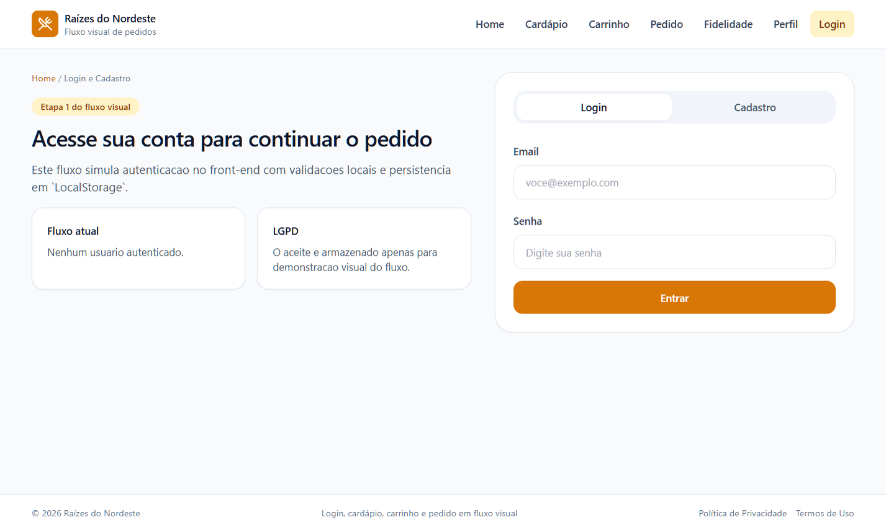
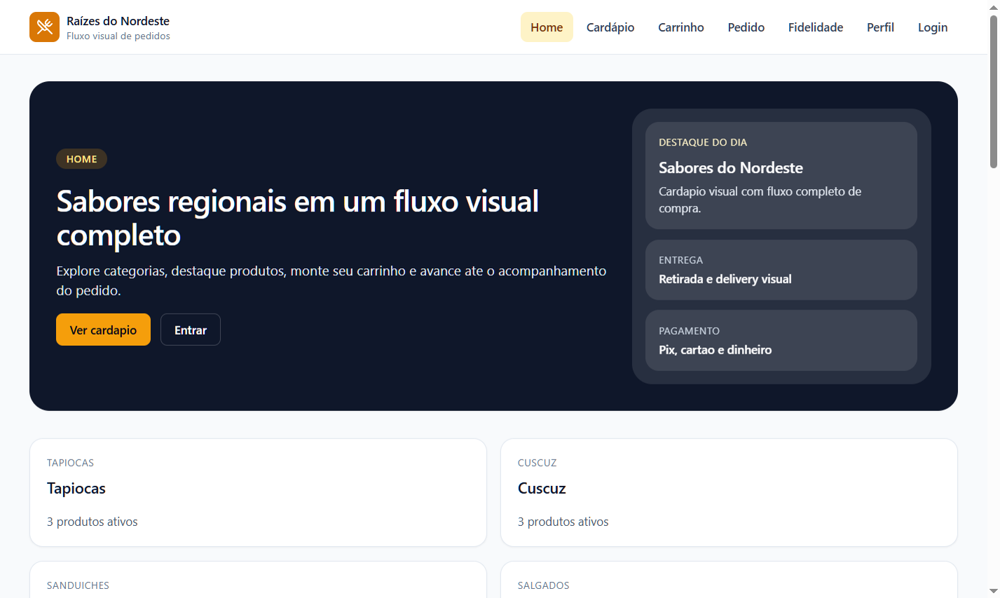
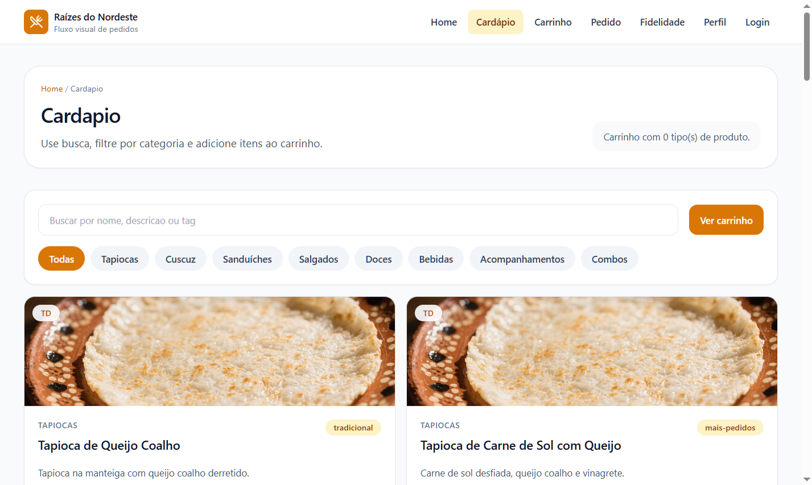
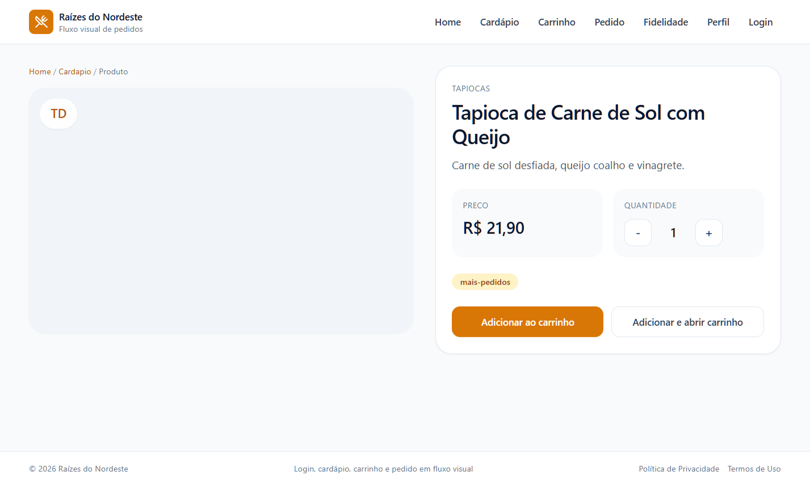
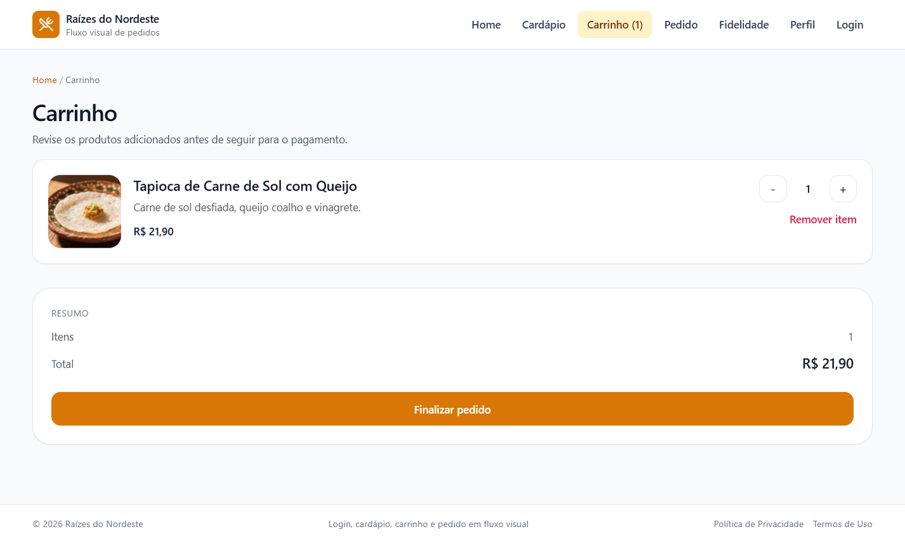
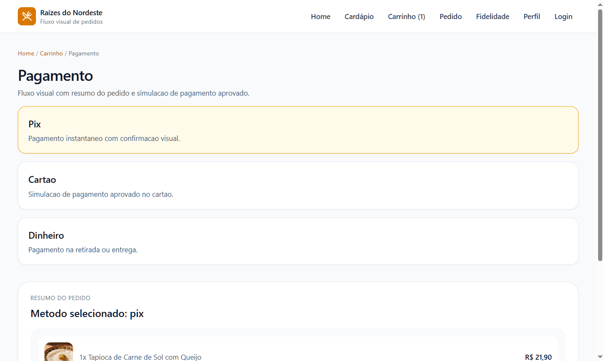
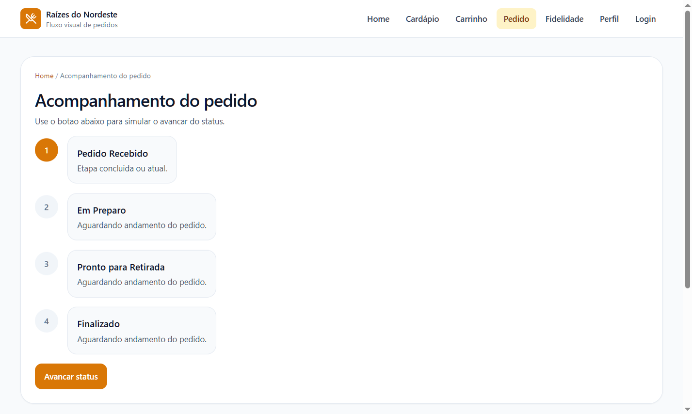
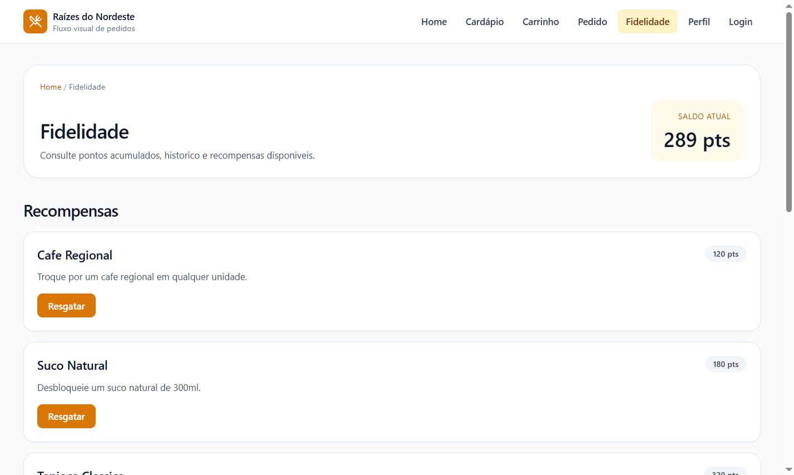
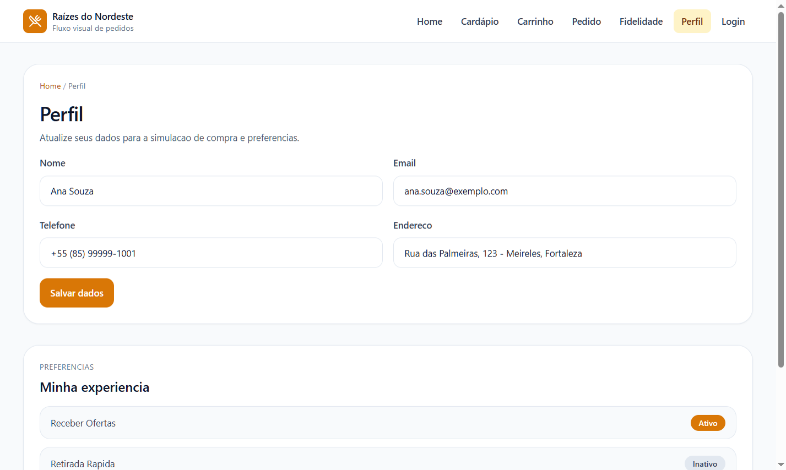

# Wireframes

Este documento reúne capturas reais das principais telas do sistema e mantém wireframes textuais como apoio estrutural.

## 1. Login / Cadastro

Componente e rota reais: `src/pages/Login/index.tsx` em `/login`



```text
+------------------------------------------------------+
| Logo                         [Login] [Cadastro]      |
|------------------------------------------------------|
| Titulo: Acesse sua conta                             |
| Texto de apoio                                       |
|                                                      |
| [Email______________________________]                |
| [Senha______________________________]                |
| [Entrar________________________________]             |
|                                                      |
| Cadastro:                                            |
| [Nome_______________________________]                |
| [Email______________________________]                |
| [Telefone___________________________]                |
| [Endereco___________________________]                |
| [Senha________] [Confirmar senha____]                |
| [ ] Aceito LGPD                                      |
| [Criar conta_________________________]               |
+------------------------------------------------------+
```

## 2. Home

Componente e rota reais: `src/pages/Home/index.tsx` em `/`



```text
+------------------------------------------------------+
| Header / Navegacao                                   |
|------------------------------------------------------|
| Banner principal                                     |
| [Ver cardapio] [Perfil/Login]                        |
|                                                      |
| Categorias                                           |
| [Tapiocas] [Cuscuz] [Doces] [Bebidas] ...            |
|                                                      |
| Produtos em destaque                                 |
| [Produto] [Produto] [Produto] [Produto]              |
|                                                      |
| Fidelidade / Ofertas                                 |
| [Saldo de pontos] [Promocoes]                        |
+------------------------------------------------------+
```

## 3. Cardápio

Componente e rota reais: `src/pages/Cardapio/index.tsx` em `/cardapio`



```text
+------------------------------------------------------+
| Breadcrumb / Titulo                                  |
| [Busca____________________________________] [Carrinho]|
| [Todas] [Tapiocas] [Cuscuz] [Doces] ...              |
|                                                      |
| [Produto Card] [Produto Card] [Produto Card]         |
| [Adicionar]    [Adicionar]    [Adicionar]            |
+------------------------------------------------------+
```

## 4. Produto

Componente e rota reais: `src/pages/Produto/index.tsx` em `/produto/:produtoId`



```text
+------------------------------------------------------+
| Breadcrumb                                           |
|------------------------------------------------------|
| [Imagem / Placeholder]        Categoria              |
|                               Nome do produto        |
|                               Descricao              |
|                               Preco                  |
|                               [-] [Qtd] [+]          |
|                               [Adicionar ao carrinho]|
|                               [Adicionar e abrir]    |
+------------------------------------------------------+
```

## 5. Carrinho

Componente e rota reais: `src/pages/Carrinho/index.tsx` em `/carrinho`



```text
+------------------------------------------------------+
| Titulo / Lista de itens                              |
|------------------------------------------------------|
| Produto A                         [-] [2] [+] Remover|
| Produto B                         [-] [1] [+] Remover|
| Produto C                         [-] [1] [+] Remover|
|                                                      |
| Resumo                                               |
| Itens: X                                             |
| Total: R$ XX,XX                                      |
| [Finalizar pedido________________________]            |
+------------------------------------------------------+
```

## 6. Pagamento

Componente e rota reais: `src/pages/Pagamento/index.tsx` em `/pagamento`



```text
+------------------------------------------------------+
| Titulo / Breadcrumb                                  |
|------------------------------------------------------|
| [Pix]                                                |
| [Cartao]                                             |
| [Dinheiro]                                           |
|                                                      |
| Resumo do pedido                                     |
| 1x Produto A                                         |
| 2x Produto B                                         |
| Total: R$ XX,XX                                      |
| [Simular pagamento aprovado______________]           |
+------------------------------------------------------+
```

## 7. Pedido

Componente e rota reais: `src/pages/Pedido/index.tsx` em `/pedido`



```text
+------------------------------------------------------+
| Acompanhamento do pedido                             |
|------------------------------------------------------|
| (1) Pedido Recebido                                  |
| (2) Em Preparo                                       |
| (3) Pronto para Retirada                             |
| (4) Finalizado                                       |
|                                                      |
| Resumo do pedido                                     |
| ID / data / forma de pagamento / total               |
| [Avancar status___________________________]          |
+------------------------------------------------------+
```

## 8. Fidelidade

Componente e rota reais: `src/pages/Fidelidade/index.tsx` em `/fidelidade`



```text
+------------------------------------------------------+
| Titulo / Saldo atual                                 |
|------------------------------------------------------|
| Recompensas                                          |
| [Cafe Regional] [Resgatar]                           |
| [Suco Natural]  [Resgatar]                           |
| [Tapioca]      [Pontos insuficientes]                |
|                                                      |
| Historico                                            |
| +45 Compra em Fortaleza                              |
| -120 Resgate de cafe                                 |
+------------------------------------------------------+
```

## 9. Perfil

Componente e rota reais: `src/pages/Perfil/index.tsx` em `/perfil`



```text
+------------------------------------------------------+
| Titulo / Breadcrumb                                  |
|------------------------------------------------------|
| [Nome______________________________]                 |
| [Email_____________________________]                 |
| [Telefone__________________________]                 |
| [Endereco__________________________]                 |
| [Salvar dados______________________]                 |
|                                                      |
| Preferencias                                         |
| [Receber ofertas]   [Ativo/Inativo]                  |
| [Retirada rapida]  [Ativo/Inativo]                   |
| [Notificacoes]     [Ativo/Inativo]                   |
+------------------------------------------------------+
```
